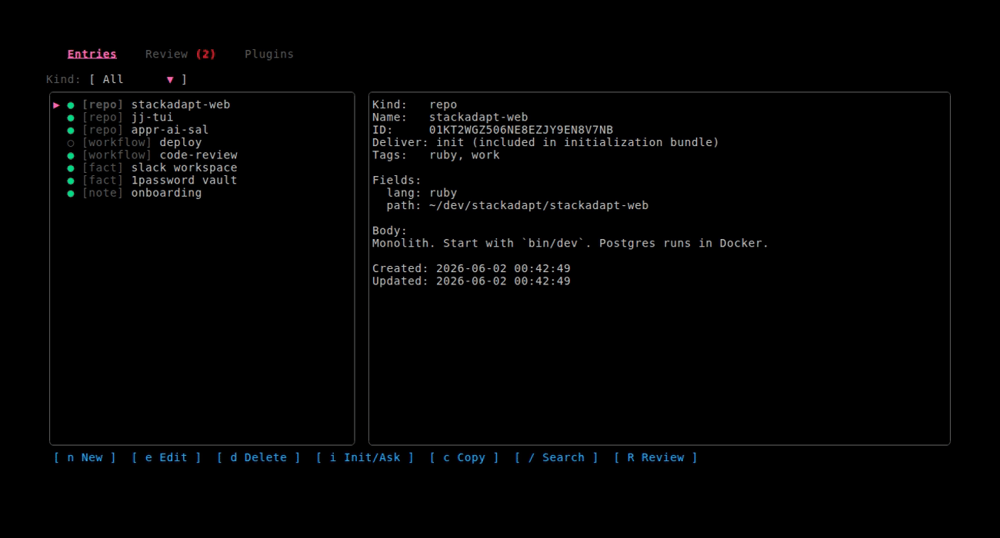
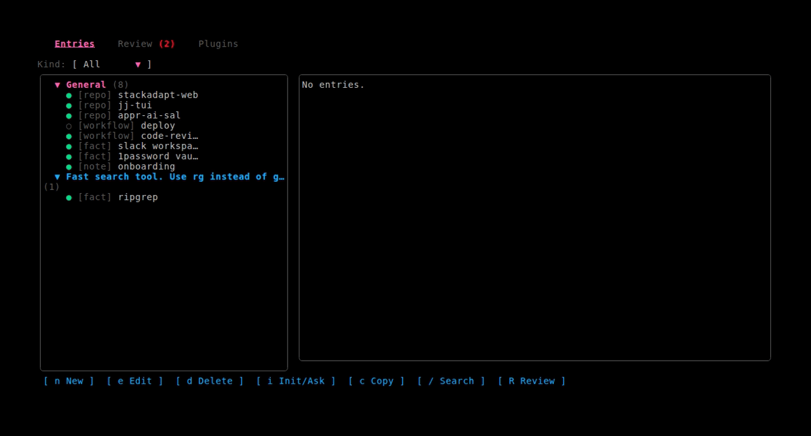
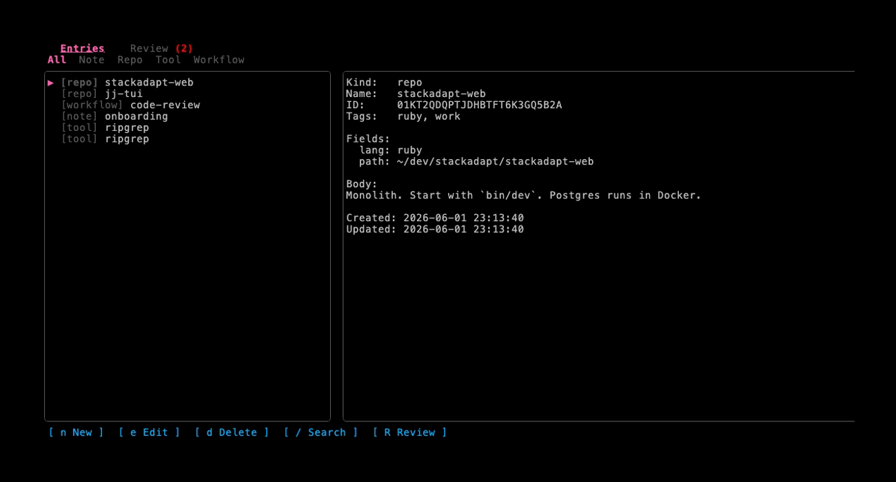
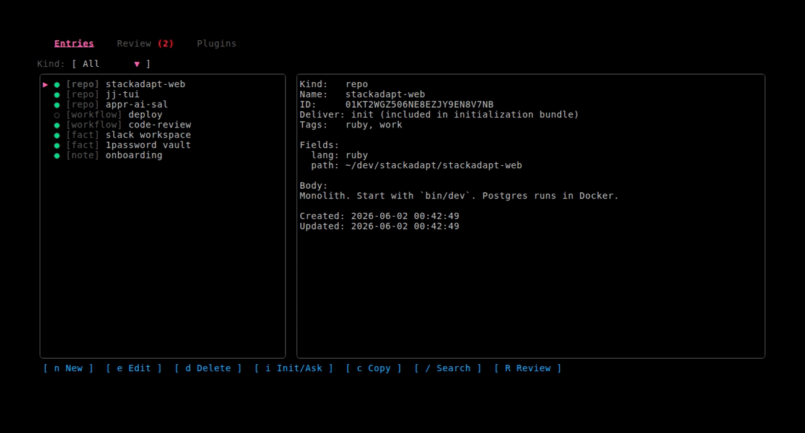
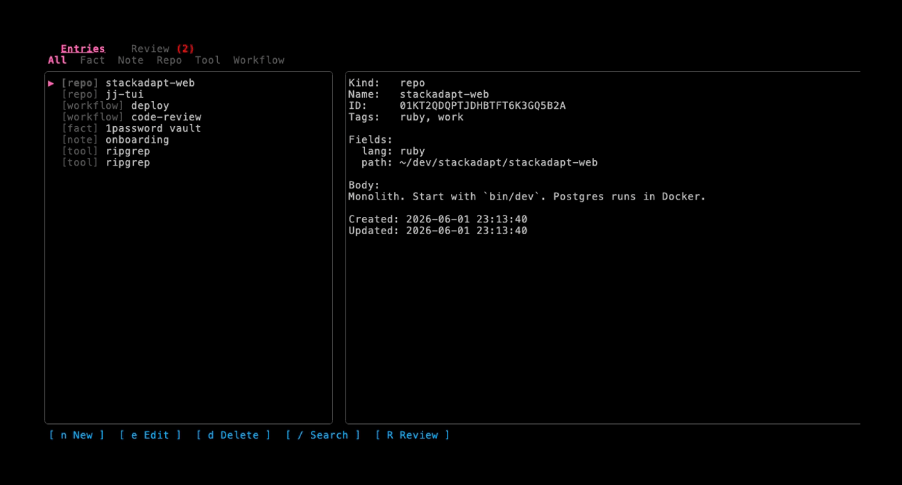
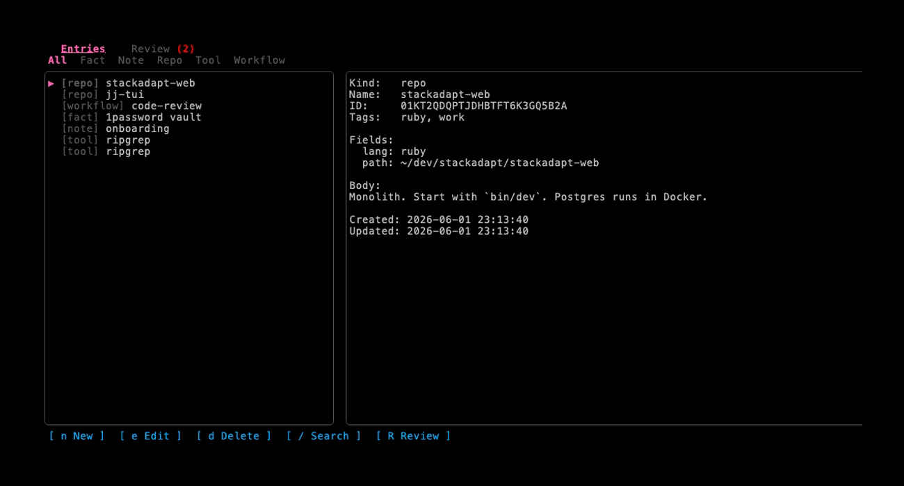
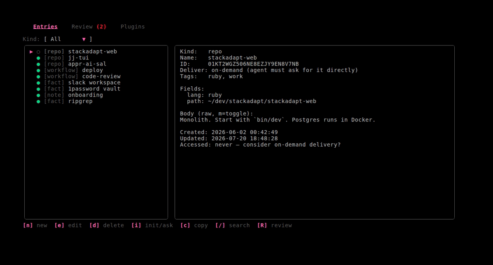
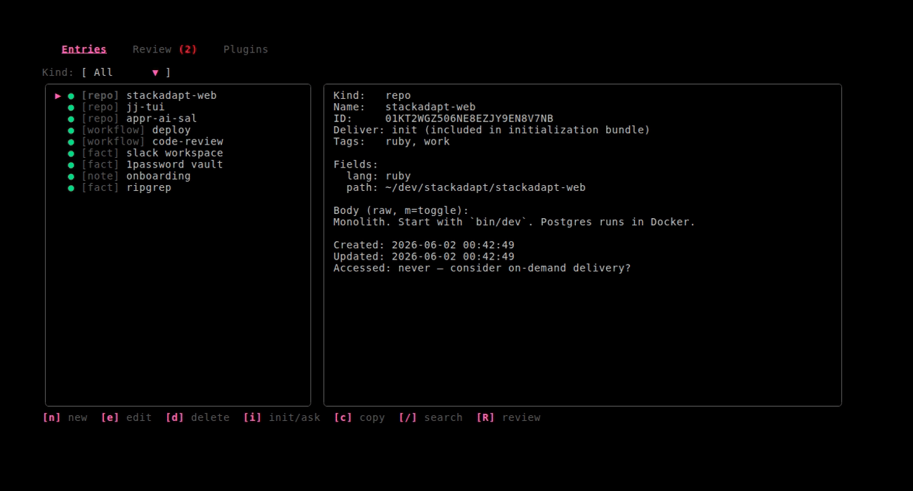
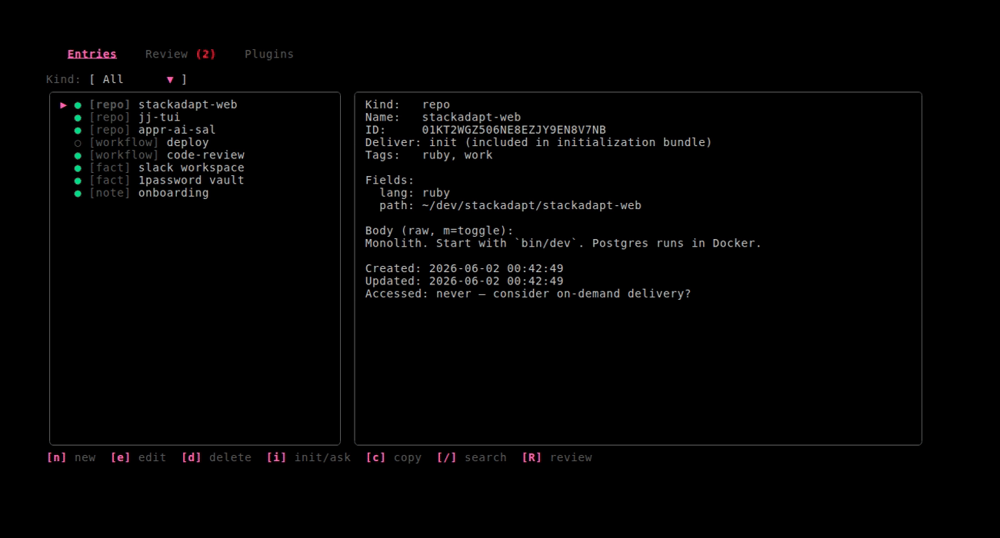

# naitv-mcp



A local **[Model Context Protocol](https://modelcontextprotocol.io/) server** and **terminal UI** for managing the context you give AI agents. It is a personal, human-in-the-loop knowledge base: you curate structured entries (rules, tooling preferences, workflows, repos, facts, notes), agents read them and can *propose* new ones, and you approve proposals from the TUI before they go live.

Built with [Bubble Tea v2](https://github.com/charmbracelet/bubbletea), [Lip Gloss v2](https://github.com/charmbracelet/lipgloss), [Bubblezone v2](https://github.com/lrstanley/bubblezone), and the [official MCP Go SDK](https://github.com/modelcontextprotocol/go-sdk), backed by SQLite (with FTS5 full-text search).

## Why

Agents like Cursor, Claude, and local models work best when they know how *you* like things done — "use jj instead of git", "do work in commits and let me check them in", "check jj-tui and appr-ai-sal for TUI patterns". naitv-mcp stores those preferences once and serves them to every agent two ways:

- **Eagerly**, as an initialization bundle the agent loads up front.
- **On demand**, as entries the agent fetches only when relevant.

You decide which is which, per entry, from the TUI.

## Features

- **MCP server** (`naitv-mcp serve`): exposes your context to any MCP client over stdio.
- **Terminal UI** (`naitv-mcp`): browse, search, create, edit, delete, review entries, and manage plugins with keyboard + mouse.
- **Human-in-the-loop**: agents can only *read* active entries and *propose* writes; proposals queue as `pending` until you approve them in the **Review** tab.
- **Initialization bundle**: the `initialize` tool and `naitv-mcp init` render your entries into a single instruction document (e.g. `AGENTS.md`).
- **Per-entry delivery**: mark each entry `init` (in the bundle) or `on-demand` (fetched directly) with one keystroke.
- **Full-text search** over all active entries (SQLite FTS5).
- **Demo mode** (`--demo`): seeded data for trying the UI or recording screenshots.

## Concepts

| Concept | Meaning |
|---------|---------|
| **Entry** | A record with a `kind`, `name`, free-form `body`, `tags`, and key/value `fields`. |
| **Kind** | A free-form label such as `rule`, `tool`, `workflow`, `repo`, `agent`, `fact`, `note`. Not enforced. |
| **Status** | `active` (visible to agents) or `pending` (an agent proposal awaiting your approval). |
| **Delivery** | `init` (included in the initialization bundle) or `on-demand` (excluded; agents fetch it via `get_entry`/`search_entries`). Defaults to `init`. |

## Initialization: how agents learn your preferences

There are two delivery mechanisms, sharing one renderer:

**1. The `initialize` MCP tool** — an agent calls it at the start of a session and gets back a markdown document of your `init`-delivery entries, grouped by kind (rules first, then tooling preferences, workflows, agent roles, repos, facts, notes). Entries marked `on-demand` are not included; the agent fetches those with `get_entry` or `search_entries` when relevant.

**2. The `naitv-mcp init` command** — writes the same document to a file that clients auto-load:

```bash
naitv-mcp init               # writes ./AGENTS.md
naitv-mcp init --out -        # print to stdout
naitv-mcp init --db /path.db  # use a specific database
```

### Choosing init vs on-demand

In the **Entries** tab, select an entry and press **`i`** (or click **`[ i Init/Ask ]`**) to toggle its delivery. The list shows a glyph per row — **`●`** init, **`○`** on-demand — and the detail pane shows the current mode.



## Screenshots

### Search
Full-text search across active entries.



### Create an entry
Press `n`, fill in kind/name/body/tags/fields, save with `Ctrl+S`.



### Edit an entry
Press `e` to edit the selected entry.



### Review agent proposals
Agent writes land as `pending` proposals. Approve (`a`), reject (`r`), edit-before-approve (`e`), or approve all (`A`).









## Installation

### Homebrew (macOS/Linux)

```bash
brew install --cask madicen/tap/naitv-mcp
```

### Go install

```bash
go install github.com/madicen/naitv-mcp/cmd/naitv-mcp@latest
```

### Build from source

```bash
./bootstrap.sh    # first time: pull deps, build, run store tests
# or:
make build        # → bin/naitv-mcp
```

## Usage

### Run the TUI

```bash
naitv-mcp              # opens the terminal UI
naitv-mcp --demo       # seeded demo data (does not touch your real DB)
```

### Run the MCP server

```bash
naitv-mcp serve                 # stdio MCP server, default DB
naitv-mcp serve --db /path.db   # custom database
naitv-mcp serve --http :8321 --token secret   # streamable HTTP (optional)
```

### Export, import, and doctor

```bash
naitv-mcp export [--out file.json]     # backup all entries
naitv-mcp import file.json [--replace] # restore from export
naitv-mcp doctor                       # DB/FTS health checks + client config snippets
```

### Init bundle with kind filter

```bash
naitv-mcp init --kinds rule,tool       # slimmer initialization document
```

Wire it into Cursor via `.cursor/mcp.json`:

```json
{
  "mcpServers": {
    "naitv-mcp": {
      "command": "/absolute/path/to/naitv-mcp",
      "args": ["serve"]
    }
  }
}
```

To nudge agents to load your preferences at session start, add a short rule (e.g. in `AGENTS.md` or your client's rules) such as: *"Call the `initialize` tool from naitv-mcp before starting work."*

### Seed demo data

```bash
naitv-mcp seed-demo    # idempotent; populates the default DB if empty
```

## MCP tools

| Tool | Description |
|------|-------------|
| `initialize` | Return the initialization bundle (all `init`-delivery entries, grouped by kind). |
| `list_entries` | List active entries, optionally filtered by `kind` and/or `tags`. |
| `get_entry` | Get a single entry by `id_or_name`. |
| `search_entries` | Full-text search over active entries (`query`). |
| `add_entry` | Propose a new entry (queued as `pending` for review). |
| `update_entry` | Propose an update to an existing active entry (queued as `pending`). |
| `list_tools` | List active executable tool entries (`kind=tool` with an `exec` field). |
| `install_plugin` | Install a plugin from URL, path, or registry name (proposals queued for review). |
| `list_plugins` | List installed plugins with version and entry count. |
| `list_available_plugins` | Fetch plugins from the public registry (or a custom `registry_url`). |
| `uninstall_plugin` | Remove a plugin and all of its entries. |
| `set_project` | For tools with a `project_root` param, restore `working_dir={project_root}`; otherwise set `working_dir` to the project root. Optionally enable lint. |
| `export_entries` | Export all entries as JSON for backup or sync. |
| `generate_continue_config` | Generate a `.continue/config.yaml` wired to this server. |

Write tools never modify active data directly — they always create a proposal you approve in the TUI.

**Dynamic executable tools:** any active `kind=tool` entry with an `exec` field is also registered as an MCP tool (named after the entry). Agents can call these after you approve them in the Review tab; the server hot-reloads tools automatically and emits `tools/list_changed` — no restart needed.

## Keyboard reference

### Entries tab

| Key | Action |
|-----|--------|
| `j` / `k` (or ↓/↑) | Move selection |
| `n` | New entry |
| `e` | Edit selected entry |
| `d` | Delete selected entry (with confirm) |
| `i` | Toggle delivery: init ↔ on-demand |
| `c` | Copy entry body to clipboard |
| `/` | Search |
| `m` | Toggle markdown rendering in detail pane |
| `u` | Undo last destructive action |
| `H` | View entry history |
| `a` | Toggle archived entries view |
| `v` | Restore archived entry (when viewing archive) |
| `P` | Permanently purge archived entry |
| `tab` | Cycle the kind filter |
| `R` | Go to Review tab |
| `q` / `Ctrl+C` | Quit |

### Form (create/edit)

| Key | Action |
|-----|--------|
| `tab` / `shift+tab` | Move between fields |
| `enter` | Activate the focused button (add field / save / cancel) |
| `Ctrl+S` | Save |
| `Ctrl+E` | Open body in `$EDITOR` |
| `esc` | Cancel |

### Review tab

| Key | Action |
|-----|--------|
| `j` / `k` | Move selection |
| `a` | Approve selected proposal |
| `r` | Reject selected proposal |
| `e` | Edit before approving |
| `Ctrl+E` | Open proposal body in `$EDITOR` |
| `m` | Toggle markdown rendering in detail pane |
| `A` | Approve all |
| `esc` | Back to Entries |

Most actions are also clickable via the on-screen buttons and tabs.

### Plugins tab

| Key | Action |
|-----|--------|
| `j` / `k` | Move selection |
| `i` | Install selected plugin (browse mode) or enter custom install URL |
| `u` | Uninstall selected plugin (installed mode) |
| `tab` | Switch between Installed and Browse views |
| `r` | Refresh the plugin registry |

Browse the public plugin registry, install plugins (entries land in Review for approval), and uninstall installed plugins.

## Configuration

| Setting | Default | Override |
|---------|---------|----------|
| Database path | `~/.config/naitv-mcp/context.db` | `--db` flag or `NAITV_MCP_DB` env var |
| Demo DB directory | temp dir | `NAITV_MCP_DEMO_DIR` env var |

## Development

### Project layout

```
naitv-mcp/
├── cmd/naitv-mcp/main.go     # entry point: TUI, serve, init, export, import, doctor, seed-demo
├── internal/
│   ├── mcp/server.go           # MCP tool definitions & handlers
│   ├── instructions/           # renders entries → initialization document
│   ├── store/store.go          # SQLite CRUD + FTS + approval workflow
│   ├── tools/                  # executable tool defs + sh -c runner
│   ├── plugin/                 # JSON manifest install/uninstall
│   ├── setup/                  # set_project, continue config helpers
│   └── tui/                    # Bubble Tea models (entries, review, plugins, form)
├── pkg/entry/entry.go          # Entry domain type
├── integration_tests/          # end-to-end TUI journeys
├── vhs/                        # VHS tapes for screenshots
├── screenshots/                # generated GIFs
└── .github/workflows/          # CI, release, screenshots
```

### Build & test

```bash
make build              # build to bin/naitv-mcp
make test               # all tests
make test-store         # store unit tests
make test-integration   # TUI integration tests
```

### Updating screenshots

Screenshots are generated with [VHS](https://github.com/charmbracelet/vhs) against seeded demo data, so they are reproducible.

**Local:**

```bash
make vhs                       # build demo binary, seed fixtures, run all tapes
make screenshot-delivery       # regenerate only screenshots/delivery-toggle.gif
make vhs/browse                # regenerate only screenshots/browse.gif (vhs/<name>)
```

Requires `vhs`, `ffmpeg`, and `ttyd` (`brew install vhs ffmpeg ttyd`).

**CI:** the [Generate Screenshots](.github/workflows/screenshots.yml) workflow regenerates all GIFs and commits them back to `main`. It runs after releases and can be triggered manually via **workflow_dispatch**.

### Releasing

Releases are cut with [GoReleaser](https://goreleaser.com/) (see [`.goreleaser.yml`](.goreleaser.yml)) and publish a Homebrew cask to `madicen/homebrew-tap`.

- **Manual release**: run the [Manual Release](.github/workflows/manual-release.yml) workflow (**workflow_dispatch**) with a version like `v1.2.3`. It validates the version, tags it, runs GoReleaser, and regenerates screenshots.
- **Tag release**: pushing a `v*` tag triggers the [Release](.github/workflows/release.yml) workflow.

## License

MIT.
